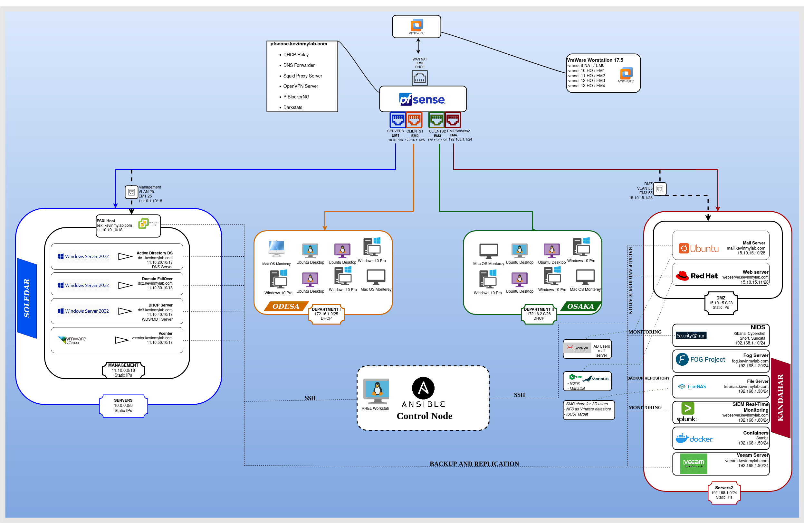

# Network Design, Implementation and Security



This lab focuses on implementing an on premise computer network infrastructure for a business. It involves designing the network, deploying the hardware, and configuring the servers and workstations.

The entire setup is virtualized, meaning that everything will run through a hypervisor. I will work with VMware Workstation as a type 2 hypervisor for this purpose. It is also possible to achieve this with a type 1 hypervisor, but that requires a dedicated station.

The diagram above shows the layout of my physical workstation at the top layer and provides an overview of what to expect from this lab at the bottom layer.

I will link a video for each part of this lab to make thinks easier to .

Before you begin, make sure to download and gather all the necessary files (ISO, software, etc.) into a single folder on your host computer. Later on, you will enable Folder Sharing in VMware Workstation and point it to that folder. Then, set up a file server that points to the same folder to simplify your deployments.

### Installing VMware workstation

Installing Development tools and Kernel Headers

```console
sudo dnf upgrade -y
sudo dnf groupinstall "Development tools"  
apt install build-essential #Run this command only if you are running a debian base distribution
```

```console
wget https://download3.vmware.com/software/WKST-1700-LX/VMware-Workstation-Full-17.0.0-20800274.x86_64.bundle 
sudo chmod +x VMware-Workstation-Full-17.0.0-20800274.x86_64.bundle
sudo ./VMware-Workstation-Full-17.0.0-20800274.x86_64.bundle

```
The set of commands above will download the latest VMware Workstation, make it executable and install it. Next just run `vmware` either from the terminal or from your installed sofwares. Follow the instructions and you should be good to go.


### Deploying the the Hardware

Configuriging Virtual Network Editors

There is no physical hardware involved in this lab, so you will need to comfigure WMware Workstation's Virtual Network Editor to simulate Physical Network interfaces. We will need 4 for this lab. The first network interface, `vmnet8` will simulated your WAN network. It does not matter what type (bridged or NAT) you choose. I personnaly went with NAT mode. The remaining 3 interfaces (vmnet10, vmnet11, vmnet12), that we will create, will simulate our LAN networks. So they have to be completely isolated. They will, hence, be configured in `Host-only` mode.

In linux you can edit vmware's networking file with

```console
sudo vi /etc/vmware/networking

```

Add the following line 
```
answer VNET_10_DISPLAY_NAME
answer VNET_10_HOSTONLY_NETMASK 255.0.0.0
answer VNET_10_HOSTONLY_SUBNET 10.0.0.0
answer VNET_10_MTU 1500
answer VNET_10_VIRTUAL_ADAPTER yes
answer VNET_11_DHCP no
answer VNET_11_DISPLAY_NAME
answer VNET_11_HOSTONLY_NETMASK 255.255.0.0
answer VNET_11_HOSTONLY_SUBNET 172.16.0.0
answer VNET_11_MTU 1500
answer VNET_11_VIRTUAL_ADAPTER yes
answer VNET_12_DHCP no
answer VNET_12_DISPLAY_NAME
answer VNET_12_HOSTONLY_NETMASK 255.255.255.0
answer VNET_12_HOSTONLY_SUBNET 192.168.1.0
answer VNET_12_MTU 1500
answer VNET_12_VIRTUAL_ADAPTER yes
```

Then do 
```console
sudo vmware-networks –start
``

Of course that configuration can also be done using the GUI. Just open VMware Workstation and go to Edit => Virtual Network Editor

Make sure, though, that DHCP is turned off on your LAN Networks. This will be handled later on by the router.

###Deploying The router, Pfsense

Now, with the Virtual Interfaces created and configured, the next step should logically be to deploy the heart of our network system, the router.

Download the latest version of Pfsense here

Open Vmware workstation and 
